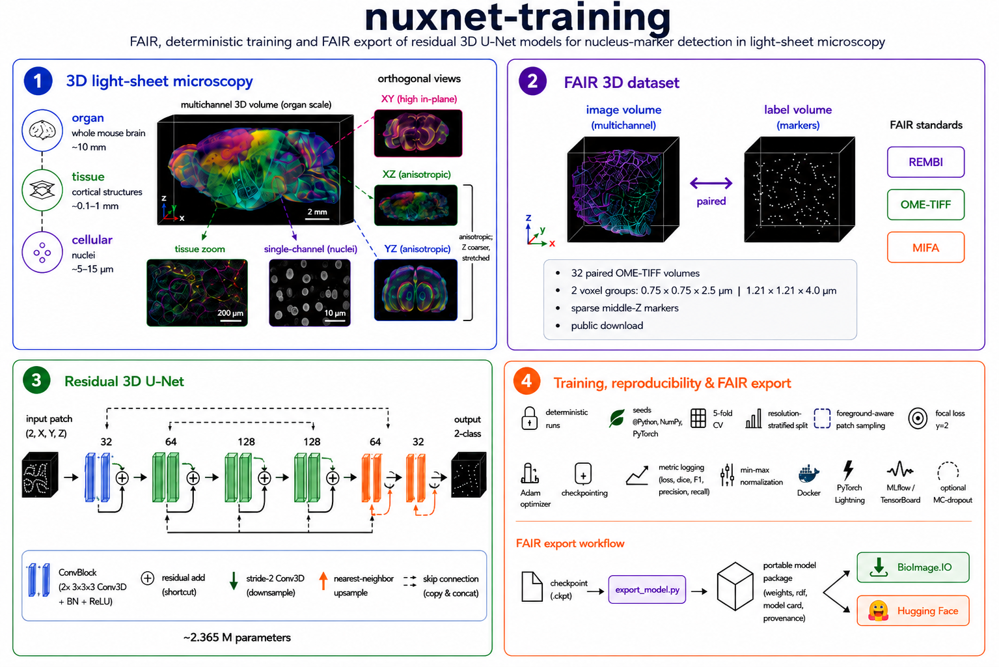

<!-- markdownlint-disable MD013 -->

# nuxnet-training



Reproducible 3D U-Net training for nucleus-marker detection in NuMorph light-sheet microscopy data. The exported PyTorch state dictionary is compatible with [`nuxnet-inference`](https://github.com/luiskuhn/nuxnet-inference).

## What this repository trains

The model is a compact residual 3D U-Net with 32-, 64-, and 128-channel feature levels. Two stride-2 convolutions form the encoder, and two nearest-neighbor upsampling stages restore the original resolution while reusing encoder features through skip connections. Every two-convolution block has a residual shortcut (a normalized 1×1×1 projection when channels change), and the final 1×1×1 head emits two-channel background/marker logits. Spatial dropout acts only on learned feature maps, never directly on the raw input.

Training uses focal loss (fixed $\gamma=2$), Adam, validation-loss checkpointing and reports loss, voxel accuracy, per-class IoU and mean IoU. Because the foreground is sparse, prefer nucleus-class and mean IoU over accuracy when comparing runs. The architecture remains below 2.5 million parameters and retains the compact model's memory profile.

The default `NUMORPH_SEM_SEG_DATASET` contains 32 paired OME-TIFF image/mask volumes: 16 at 0.75 × 0.75 × 2.5 µm and 16 at 1.21 × 1.21 × 4.0 µm. Images are normalized, single-channel `float32`; masks are binary `uint8`.

> [!IMPORTANT]
> Masks are manually curated **2D middle-Z nucleus markers for detection**, stored in 3D volumes. They are not complete 3D boundaries or instance segmentations. Confirm the dataset's reuse terms before redistribution because its packaged metadata currently records the license and public resource identifiers as pending.

## Quick start with Docker

Docker is recommended because it provides pinned Python and CUDA dependencies. Build the image, create persistent output directories, and train on an extracted dataset:

```bash
mkdir -p "$PWD/mlruns" "$PWD/output"
docker build -t nuxnet-training .

docker run --rm \
  -v "$PWD/dataset:/data:ro" \
  -v "$PWD/mlruns:/mlruns" \
  nuxnet-training \
  --dataset-path /data --max_epochs 100 --accelerator cpu --devices 1
```

`--dataset-path` also accepts a ZIP. To download the public dataset automatically, mount a writable directory and use:

```bash
docker run --rm \
  -v "$PWD/data:/data" -v "$PWD/mlruns:/mlruns" \
  nuxnet-training \
  --download-dataset --dataset-path /data/NUMORPH_SEM_SEG_DATASET.zip \
  --max_epochs 100 --accelerator cpu --devices 1
```

For an NVIDIA GPU, install the NVIDIA Container Toolkit and add `--gpus all` to `docker run`, then pass `--accelerator gpu --devices 1`. The best inference-compatible model is written to the mounted `mlruns/numorph_unet3d.pt`; Lightning checkpoints and TensorBoard events are stored below the same directory.

## Hyperparameters

These options have the greatest effect on training quality, runtime, and memory:

| Hyperparameter | CLI flag | Default | Description |
| --- | --- | ---: | --- |
| Epochs | `--max_epochs` | `1000` | Maximum training epochs. |
| Learning rate | `--lr` | `0.0001` | Adam learning rate. It is reduced 10× after 10 stagnant training-loss epochs, to a minimum of `1e-6`. |
| Patch size | `--patch-size Z,Y,X` | `32,128,128` | Spatial context per sample. Each dimension must be divisible by four; larger patches require more memory. |
| Training batch size | `--training-batch-size` | `1` | Patches per optimizer step. Increase only when memory permits. |
| Patches per volume | `--patches-per-volume` | `8` | Random training patches drawn from each volume per epoch. Higher values provide more sampling at greater runtime. |
| Foreground sampling | `--foreground-patch-probability` | `0.8` | Probability that a training patch is centered on a marker (`0`–`1`). |
| Class weights | `--class-weights` | `0.2,1.0` | Comma-separated focal-loss weights for background and marker. Supply one value per output class. |
| Dropout | `--dropout-rate` | `0.10` | Probability for all 3D dropout layers: two per residual convolution block and one after each down/up transition. |
| Rotation | `--random-rotation-degrees` | `2.0` | Maximum random 3D training rotation; use `0` to disable augmentation. |
| Folds | `--cross-validation-folds` | `5` | Number of shuffled, resolution-group-stratified folds (at least two). |
| Held-out fold | `--validation-fold` | `0` | One-based validation/test fold. `0` selects reproducibly from the general seed. |
| Validation interval | `--test-epochs` | `10` | Run validation every N epochs. Final testing always uses the best checkpoint. |
| Input normalization | `--normalize-input` / `--no-normalize-input` | enabled | Per-volume min/max normalization compatible with inference. Disable only for prepared inputs. |

Reproducibility and execution options:

| CLI flag | Default | Description |
| --- | ---: | --- |
| `--general-seed`, `--pytorch-seed` | `0`, `0` | Python/NumPy and PyTorch random seeds. |
| `--accelerator` | `auto` | Lightning accelerator: `auto`, `cpu`, or `gpu`. |
| `--devices` | `auto` | Device count or `auto`; use with `--strategy` for distributed training. |
| `--num_workers` | `2` | Data-loader workers. Increase when input loading limits throughput. |
| `--log-interval` | `100` | Training steps between log writes. |
| `--n-channels`, `--n-class` | `1`, `2` | Input channels and output classes. Defaults match NuMorph and inference. |
| `--test-batch-size` | `1` | Validation/test batch size. |
| `--max-training-volumes`, `--max-validation-volumes` | unset | Limit volumes after splitting for smoke tests only. |

Dataset options are `--dataset-path`, `--download-dataset`, `--dataset-url`, and `--overwrite-dataset`. Run `docker run --rm nuxnet-training --help` (or the Python command below with `--help`) for the authoritative complete CLI.

### Monte Carlo dropout inference

The core `UNet3D` returns logits. For repeated stochastic inference passes, call
`enable_mc_dropout(model)` after loading weights. The helper first puts the whole
model in evaluation mode, then enables only `Dropout3d`; `BatchNorm3d` remains in
evaluation mode so its running statistics are not updated:

```python
from numorph_nuclei_segmentation.model import enable_mc_dropout

enable_mc_dropout(model)
samples = [model(volume).softmax(dim=1) for _ in range(20)]
```

Aggregate those samples in downstream inference code as appropriate. The helper
intentionally does not prescribe an uncertainty metric or aggregation strategy.

## Example configurations

### Production GPU run

This retains the recommended patch and sampling defaults while making the fold explicit:

```bash
docker run --rm --gpus all \
  -v "$PWD/dataset:/data:ro" -v "$PWD/mlruns:/mlruns" \
  nuxnet-training \
  --dataset-path /data --accelerator gpu --devices 1 \
  --max_epochs 1000 --lr 0.0001 \
  --patch-size 32,128,128 --training-batch-size 1 \
  --patches-per-volume 8 --foreground-patch-probability 0.8 \
  --class-weights 0.2,1.0 --validation-fold 1
```

### Fast end-to-end smoke test

This verifies download, loading, training, validation, testing and export; its small sample and patches do **not** measure model quality:

```bash
docker run --rm \
  -v "$PWD/data:/data" -v "$PWD/mlruns:/mlruns" \
  nuxnet-training \
  --download-dataset --dataset-path /data/NUMORPH_SEM_SEG_DATASET.zip \
  --accelerator cpu --devices 1 --max_epochs 2 --test-epochs 1 \
  --max-training-volumes 2 --max-validation-volumes 1 \
  --patch-size 8,32,32 --patches-per-volume 1 \
  --random-rotation-degrees 0 --num_workers 0 --log-interval 1
```

### Tune foreground imbalance

Draw every patch around a marker and increase its loss contribution:

```bash
python -m numorph_nuclei_segmentation.numorph_nuclei_segmentation \
  --dataset-path data/NUMORPH_SEM_SEG_DATASET \
  --foreground-patch-probability 1.0 --class-weights 0.1,1.0 \
  --patches-per-volume 12 --lr 0.0001
```

Change one variable at a time and compare the held-out nucleus IoU using the same explicit `--validation-fold` and seeds.

## Dataset format and splitting

`--dataset-path` may be an extracted directory or ZIP containing BioImage Archive-style tables. `images.tsv` requires `image_id` and `filename`; `annotations.tsv` requires `image_id` and `filename` (an `annotation_id` is recommended):

```tsv
# images.tsv
image_id	filename
sample-001	images/sample-001.ome.tiff
```

```tsv
# annotations.tsv
annotation_id	image_id	filename
mask-001	sample-001	annotations/sample-001.ome.tiff
```

Paths are relative to the dataset root and every image must have exactly one mask. Images may be `YX`, `ZYX`, or `CZYX`; masks must contain only integer class values `0` and `1`. Non-singleton scene/time dimensions must be exported as separate records. Common BIA aliases such as `image_uuid`, `source_image_id`, `file_name`, and `file_path` are also accepted.

All records participate in a shuffled, group-stratified split. The held-out fold supplies both validation data during fitting and final test metrics; a run fits **one model**, not one model per fold. The resolved fold is printed and logged to MLflow as `selected_validation_fold`.

Training uses random crops, foreground-aware sampling and rotation; validation/test use centered crops. Smaller volumes are zero padded. Input images use trilinear interpolation and masks use nearest-neighbour interpolation.

## Other ways to run

### Conda

```bash
conda env create -f environment.yml
conda activate nuxnet-training
python -m numorph_nuclei_segmentation.numorph_nuclei_segmentation \
  --dataset-path data/NUMORPH_SEM_SEG_DATASET \
  --max_epochs 100 --accelerator cpu --devices 1
```

Local runs write output below `lightning_logs/`.

### MLflow

The `MLproject` uses the published container and mounts `data/`, `mlruns/`, and `output/`:

```bash
python -m pip install mlflow==2.16.2
mlflow run . --build-image \
  -P dataset-path=/data -P max_epochs=100 \
  -P accelerator=cpu -P devices=1
```

Use `-A runtime=nvidia -P accelerator=gpu` for a GPU. MLflow parameters use `-P name=value`, while direct Python/Docker execution uses the corresponding `--name value` CLI flag.

## Export metric plots

Export loss, accuracy and IoU charts from the newest TensorBoard run as PNG (default) or SVG:

```bash
python tools/export_training_plots.py \
  --logdir mlruns --output-dir output/plots --format png
```

With Docker, mount both directories and run the same tool at `/app/tools/export_training_plots.py`. It is safe to rerun while training; metrics not yet available are skipped.

## Outputs and compatibility

| Output | Docker location |
| --- | --- |
| Inference state dictionary | `/mlruns/numorph_unet3d.pt` |
| Best Lightning checkpoint | `/mlruns/checkpoints/` |
| TensorBoard events | `/mlruns/lightning_logs/` |

The state dictionary contains the plain `UNet3D` weights expected by `nuxnet-inference`; use its `--classes 2` option. Dependencies are pinned to Python 3.12, PyTorch 2.5.1, NumPy 1.26.4 and tifffile 2024.8.30. This project is released under the MIT license.
